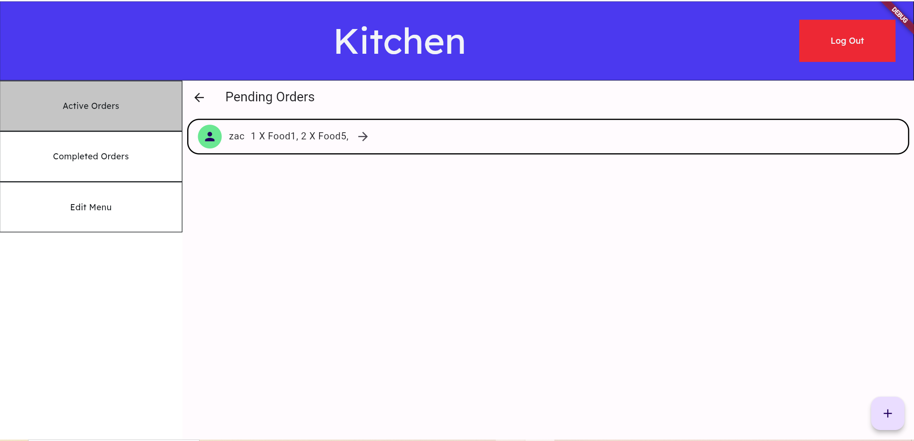

Scope of the Project
====================

Till Functionality
------------------

The Till section of the project allows the user to add food elements to an order and then place that order along with
a name.
Placing the order will submit this data to a firebase firestore database.

Kitchen Functionality
---------------------

The Kitchen will display all current orders in the database via one of two methods:

Active Orders - This is the default setting of all orders submitted to the database. These orders are also displayed by default when the user
first logs into the kitchen screen.

Completed Orders - These are orders displayed under the completed order tag and can be manually toggled by the user,
a process further described below.

.. image:: /images/completed_orders.png
    :target: /images/completed_orders.html
    :alt: Completed Orders

Order Completion - when the user wants to change an order from active to completed,
they can press the button on the order tab labelled as a forward facing arrow.

Login Functionality
-------------------

The functionality of the login screen is purely to assure secure access to the kitchen screen.
The user must input the valid passcode using either the keypad UI or a connected input device.

.. image:: /images/login_screen.png
:width: 400
:alt: Login Screen

