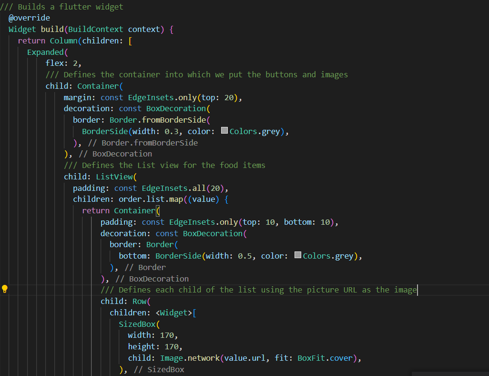
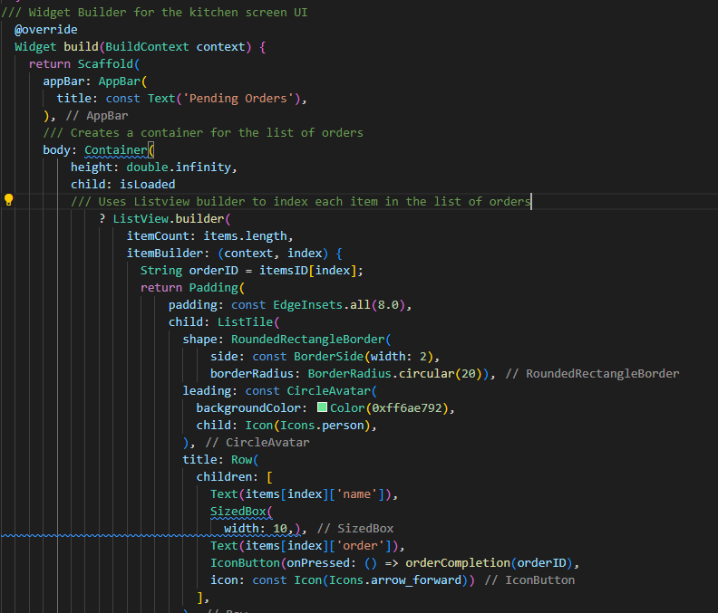
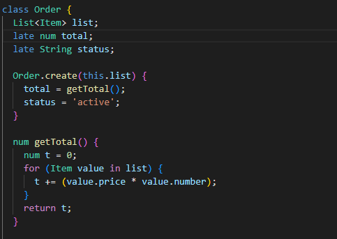
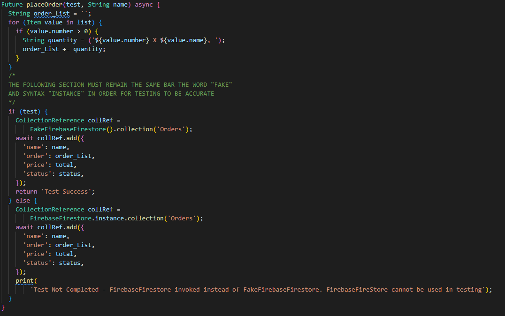
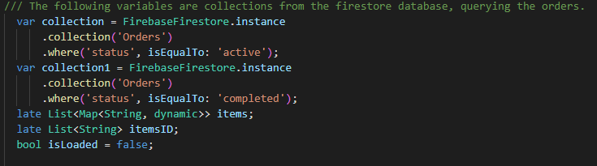
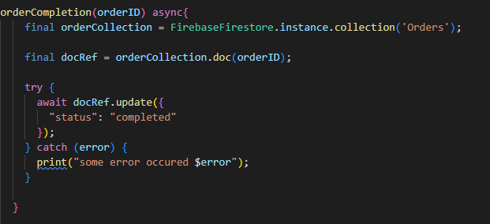

The Implementation Process
==========================

Frontend UI Design
------------------

We first started by designing the user interfaces for both the kitchen and the till screens

As shown above, we used flutter's widget build functionality to design the buttons and
implement imagery for the till screen.

And again for the Kitchen screen using the same widget design

Backend and Database Functionality
----------------------------------

To Implement the Backend for the pay button on the till screen we used a class and 
created the necessary attributes for each order as shown below.

We then used a method to build the list of items and to store the name given at payment and all of these attributes
were stored using firestore.

For the Kitchen screen, we used firestore's collection queries to gather all of the orders from the 
firestore database.

We then built a list of active and completed orders based on the 'status' attribute of the orders.

To implement the order completion, we used a flutter button which called a function
to change the status of the specified order, shown below

